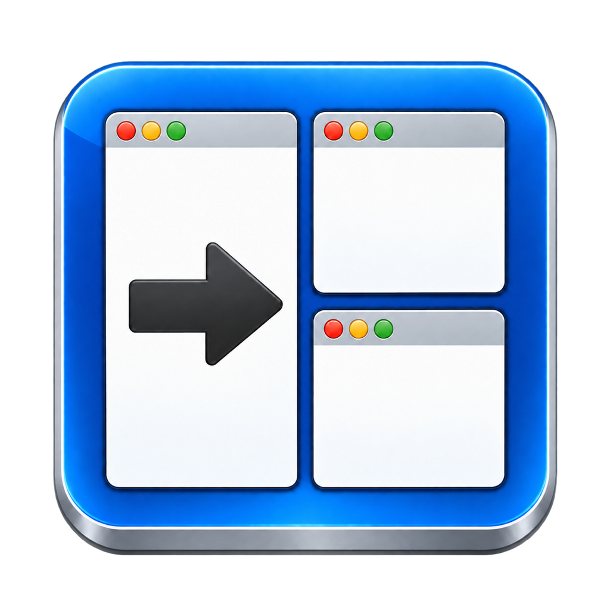

# Simple Window Manager

A small, dependency-free macOS menu-bar app, currently named **Optimal Layout**.
Arrange the focused window with keyboard shortcuts or menu commands.
Requires macOS 14+ and full Xcode with a Swift 6 toolchain to build.

## Setup

Select Xcode as the active developer directory and complete its first-launch
setup. Check with `xcode-select -p` and `xcrun swift --version`; if needed, run
`sudo xcode-select --switch /Applications/Xcode.app/Contents/Developer`.
No Homebrew packages or third-party dependencies are needed.

Choose an existing code-signing identity once per Mac:

```sh
security find-identity -v -p codesigning
printf '%s\n' '<identity name or hash>' > .codesign-identity
make run
```

`.codesign-identity` is git-ignored; the private key stays in Keychain.
`CODE_SIGN_IDENTITY` overrides the file. Missing or unusable signing configuration
fails the build. For an explicit ad-hoc build, use `CODE_SIGN_IDENTITY=- make build`,
but Accessibility access may reset after code changes.

`make run` builds and opens `Optimal Layout.app` in the repo root. Look for **OL**
in the menu bar; there is no Dock icon or main window. Quit OL before rebuilding.
Prefer the bundled app over `swift run` so permissions apply to the app you use.

On first launch, grant access in **System Settings → Privacy & Security →
Accessibility**. The **Accessibility Settings…** menu item opens that pane.
If OL is missing, use **+** to add the generated app.

## Window controls

Focus a normal resizable window, then use a shortcut or its menu command:

| Shortcut | Action |
| --- | --- |
| ⌘⌥1 | Fill the display's usable area |
| ⌘⌥2 | Cycle left half → right half |
| ⌘⌥3 | Centered, full-height half-width window |
| ⌘⌥4 | Cycle upper-left → upper-right → lower-right → lower-left |
| ⌘⌥0 | Move to the next display |

Cycles are shared across windows and reset on restart. Display switching
preserves window size and relative position. Quit the legacy Optimal Layout
or other apps using these shortcuts to avoid conflicts.

Failed commands beep and change the label to **OL!**. Open **Window Command
Failed…** for the reason and recovery advice, also shown in the tooltip.
Partial moves are reported; failed layouts do not advance the cycle. A successful
command clears the window error.

**Shortcut Problems…** identifies registration failures. Other shortcuts and
menu commands remain available. Resolve the conflict and restart OL to retry.
Conflict detection covers errors reported by Carbon, not every third-party
shortcut interception mechanism.

## Launch at Login

Choose **OL → Launch at Login** to toggle startup for your account. A checkmark
means enabled; a dash means approval is required. Use **Approve Launch at Login…**
to open System Settings, or click the pending toggle to cancel registration.
Keep the app at a stable path; rebuilding in place preserves it.

## Build and test

| Command | Purpose |
| --- | --- |
| `make run` | Build and open the app |
| `make build` | Package and sign a native debug app |
| `make release` | Package and sign a universal arm64 + x86_64 release |
| `swift build` | Compile the executable only |
| `make check-accessibility` | Check the existing bundle's Accessibility grant |
| `make test` | Run unit tests without Accessibility permission |
| `make smoke-test` | Run GUI checks on a logged-in desktop |

Debug and release builds write the same `Optimal Layout.app`. Notarization and
a distribution pipeline are not configured.

The 24 unit tests cover window geometry, display selection, layout cycles,
Accessibility failures, and shortcut registration. They do not move real windows
or register real shortcuts.

The GUI suite builds `.build/OL Smoke Test.app`, which needs its own Accessibility
grant alongside OL's. Grant it on first run, then rerun. **Leave the keyboard and
mouse idle during the test.** It uses disposable windows; click **Stop Test** or
close the test window to cancel. Checks cover layouts, shortcuts, menu commands,
error feedback, and display switching (skipped with one display).

To include login-item registration and persistence checks:

```sh
bash scripts/smoke-test.sh --login-item
```

This changes the real login setting and restores it afterward; a force-killed
run may require manual restoration. Resolve pending macOS approval first.
Actual startup after login remains a manual check.

Logs are in `.build/smoke-test.log` and `.build/smoke-test-stderr.log`.
Failures, cancellation, or missing permissions return a nonzero status. The
harness cleans up and restarts OL afterward. After a force-kill, remove a stale
`.build/smoke-test.lock` only after confirming no helper is running.

**Last verified, 2026-09-28:** 24 unit tests and 31 GUI checks passed on an M4
MacBook Air with two displays, including login-item restoration. Universal builds
and Accessibility retention across certificate-signed rebuilds also passed.
Toolchain: Xcode 26.3 / Swift 6.2.4 on macOS 15.8.

## Accessibility after rebuilding

Keep the same signing identity and bundle identifier to preserve access. Switching
from ad-hoc to certificate signing may require a fresh grant. If commands stop
working after a rebuild:

1. Quit OL.
2. Remove **Optimal Layout** from System Settings → Privacy & Security → Accessibility.
3. Use **+** to add the rebuilt `Optimal Layout.app` and enable it.
4. Reopen it without rebuilding: `open "Optimal Layout.app"`.

Use `make check-accessibility` before and after a rebuild to verify access.
It checks the existing bundle without prompting or moving windows, writes
`.build/accessibility-check.log`, and fails if access is denied.

## Current scope

Four built-in layouts and focused-window commands. Preferences, custom layouts,
and per-application rules are not implemented. Third-party/full-screen window
constraints and additional display arrangements still need validation. The app
checks API results but does not read frames back, so an app can report success
while constraining the requested size. Login-item approval and registration-error
dialog paths also remain unverified.

## App icon



The icon is an homage to the original Optimal Layout app's icon, carrying forward
its window-and-arrow motif in a blue, dimensional design.

The [1024px master](Resources/AppIcon.png) and [macOS iconset](Resources/AppIcon.iconset/)
produce the bundled `Resources/AppIcon.icns`. To repack the existing sizes:

```sh
iconutil -c icns Resources/AppIcon.iconset -o Resources/AppIcon.icns
```

## Design and investigation

- [Reverse-engineering findings](optimal-layout-reverse-engineering.md)
- [Original investigation and handoff](optimal-layout-reverse-engineering-handoff.md)
